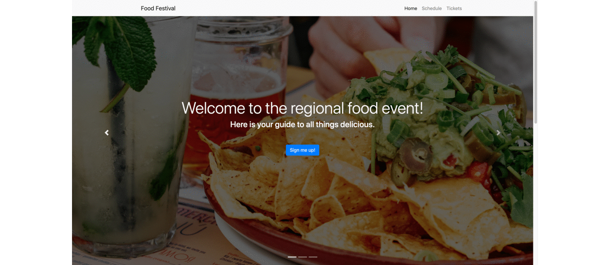
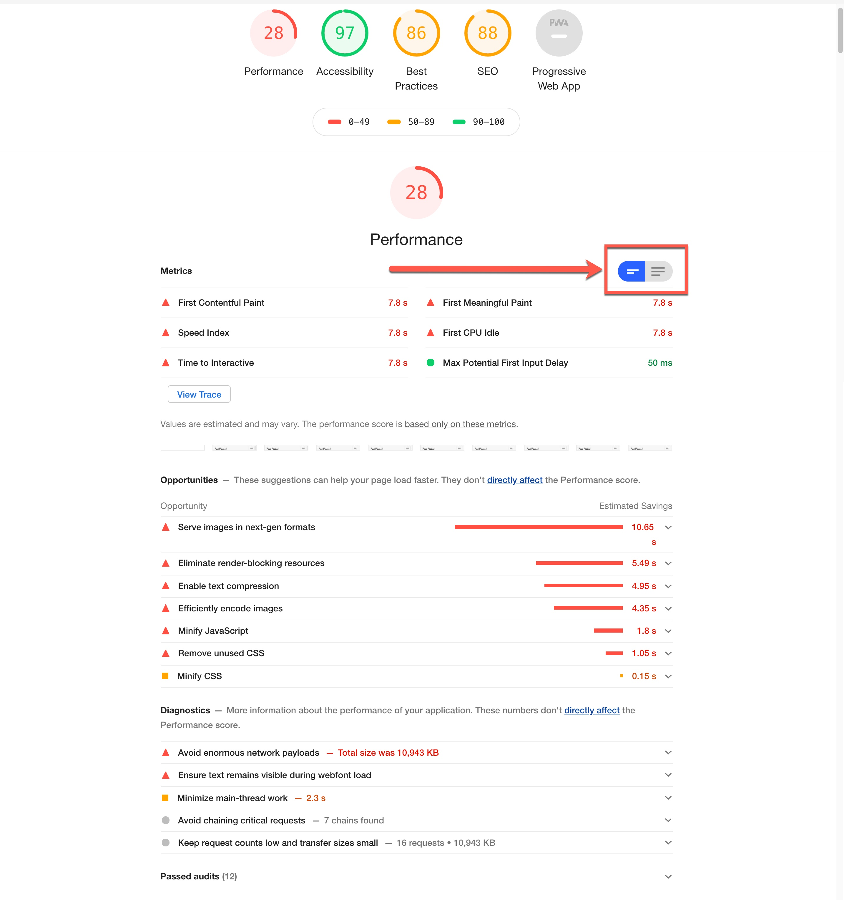

## Food Festival

### Description

*Build a web application for an upcoming three-day food event. The current app loads very slowly when the client simulates a 4G internet connection using Chrome DevTools. The client needs a fast and performant application, especially on mobile, because the app is designed for event attendees who will be using it on their phones*

### App Deployment

https://priyaravi23.github.io/food-festival/

### App Screenshot

### Tackle Performance Issues

- Google has a tool called Lighthouse which allows us to run an audit on our page and discover different metrics about how it performs, as well as what might be hindering its performance
- Lighthouse is a high-quality auditing tool for analyzing webpages. It provides audits for performance, accessibility, SEO (Search Engine Optimization), and Progressive Web Applications

### Tools Used

- https://javascript-minifier.com/
- https://imagecompressor.com/